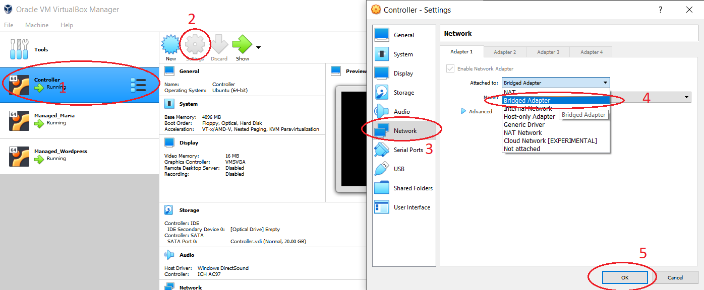
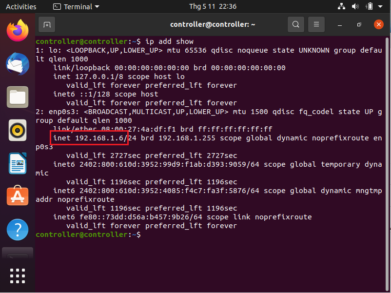
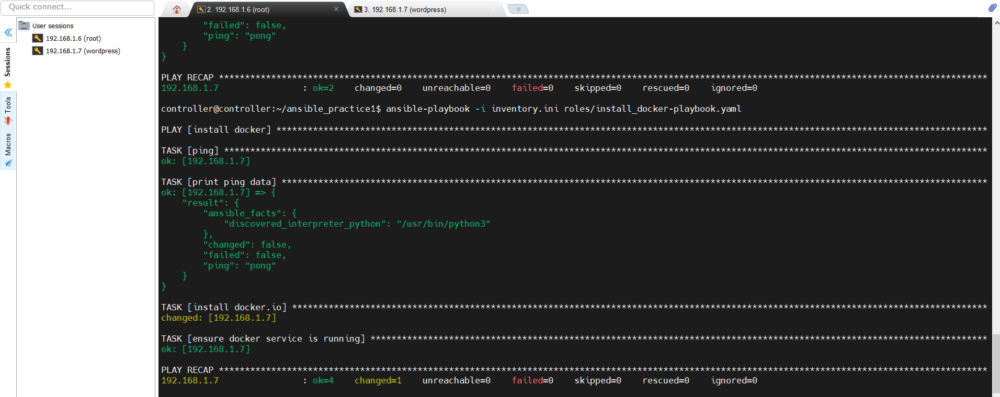
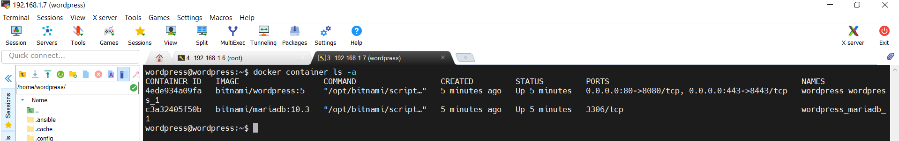
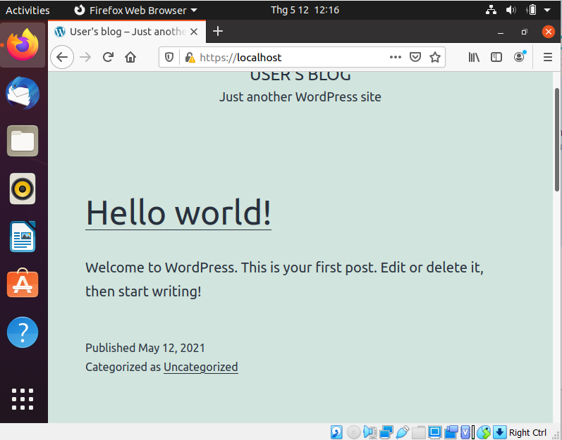

# Bài tập tuần 2

## Những thứ cần chuẩn bị trước :
### 1.  4 Ubuntu Virtual Machine ( máy chủ Ubuntu ảo ):

 1. Controller VM
 
 2. MariaDB VM
 
 3. Wordpress VM
 
 4. All-In VM 

### 2. Đổi adapter từ NAT sang Bridged Adapter

Với mỗi VM, ta thực hiện các bước như sau: 

> Bước 1 : Chọn VM 
 Bước 2: Chọn Settings
 Bước 3: Chọn Network ở thanh menu bên trái
 Bước 4: Tại phần "Attached to" chọn Bridged Adapter
 Bước 5: Nhấp OK để lưu

### 3. Lấy địa chỉ IP của máy chủ ảo

Chạy lệnh sau trên terminal : 

    $ ip add show

Kết quả trả về sẽ hiện thị IP của máy chủ đó ( ex : 192.168.1.6 )
### 4. Cài đặt *openssh-server* 

    $ sudo apt install openssh-server

### 5. Cài đặt *sshpass*

    sudo apt-get install sshpass

# Thực hành

## Practice 1

Bài này, chúng ta thực hiện setup Ansible trên Controller VM, sau đó sử dụng Ansible để cài đặt Docker lên All-In VM và deploy Wordpress.

## Phần 1: Setup Ansible

### 1. Cài đặt *curl*

    $ sudo apt install curl

### 2. Cài đặt *python3*

    $ sudo apt-get install python3.8

### 3. Cài đặt *pip*

    $ sudo apt install python3-pip

### 4. Cài đặt Ansible

    $ sudo apt install ansible

## Phần 2: Sử dụng Ansible để cài đặt Docker
  
  *Tạo project folder 'ansible_practice1'. Sau đó:* 

### 1. Khai báo file '*ansible.cfg':

    [defaults]
    host_key_checking = False
    remote_user = controller
### 2. Khai báo file 'inventory.ini':

    [wp]
    192.168.1.7
    [wp:vars]
    ansible_become_pass=wordpress
    ansible_ssh_pass=wordpress
    ansible_user=wordpress
    
### 3. Viết task cài đặt Docker:

Bước 1: Tạo thư mục roles, trong đó tạo file 'install_docker-playbook.yaml'

    - name : install docker
      hosts: wp
      gather_facts: false
    
      tasks:
      - name : ping
        ping:
        register: result
    
      - name : print ping data
        debug:
          var : result
    
      - name : install docker.io
        become : yes
        apt: 
          name : docker.io
          state: present
      
      - name : ensure docker service is running
        become : yes
        service: 
          name: docker
          state: started

Bước 2 : Run playbook:

    ansible-playbook -i inventory.ini roles/install_docker-playbook.yaml

Kết quả trả về khi thành công: 

## Phần 3: Sử dụng Ansible để deploy Wordpress

Bước 1: Viết file 'deploy_wordpress-playbook.yaml' :

    - name : install docker
      hosts: wp
      gather_facts: false
    
      tasks:
      - name : ping
        ping:
        register: result
    
      - name : print ping data
        debug:
          var : result
    
      - name : ensure docker service is running
        become : yes
        service: 
          name: docker
          state: started
      
      - name : install python3, pip
        become : yes
        apt: 
          name : python3, python3-pip 
          state: present
          
      - name: check install python3
        command:
          cmd: python3 --version
        register: result_py
          
      - name: print check python3
        debug:
          var : result_py
    
      - name: install docker_compose
        command: 
          cmd: pip3 install docker docker-compose
        register: result_install_compose_pkg
    
      - debug:
          var: result_install_compose_pkg
          
    
      - name: Tear down existing services
        get_url:
         url: "{{ docker_compose_url }}"
         dest: /home/wordpress/docker-compose.yml
        register : output
        
      - debug:
          var: output
        
      - name: Create and start services
        docker_compose:
          project_src: /home/wordpress
          state: present
        register: output
    
      - debug:
          var: output

Bước 2: Run playbook :

    ansible-playbook -i inventory.ini roles/deploy_wordpress-playbook.yaml

Bước 3 : Kiểm tra trên máy host :

    docker container ls -a

Truy cập https://localhost:8443 trên máy host để kiểm tra wordpress đã chạy hay chưa :

